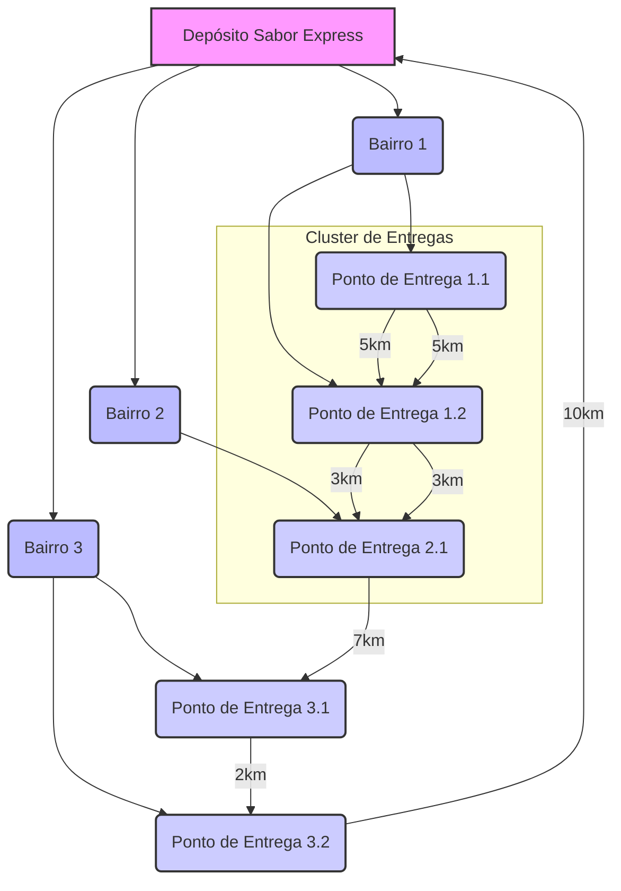

# Rota Inteligente: Otimização de Entregas com Algoritmos de IA

## 1. Descrição do Problema, Desafio Proposto e Objetivos

### 1.1. Descrição do Problema

A empresa de delivery de alimentos "Sabor Express", atuante na região central da cidade, enfrenta desafios significativos na gestão de suas entregas, especialmente em horários de pico. A definição manual de rotas, baseada unicamente na experiência dos entregadores, resulta em ineficiências como atrasos, aumento nos custos de combustível e, consequentemente, insatisfação dos clientes. Para manter a competitividade no mercado, torna-se crucial otimizar as entregas, visando torná-las mais rápidas, eficientes e econômicas.

### 1.2. Objetivos

Este projeto tem como objetivos principais:

*   Implementar algoritmos de busca em grafos (como A*, BFS ou DFS) para identificar o menor caminho entre múltiplos pontos de entrega.
*   Utilizar algoritmos de clustering (como K-Means) para agrupar entregas em zonas eficientes, especialmente em situações de grande volume de pedidos.
*   Avaliar e comparar as soluções propostas por meio de métricas adequadas, demonstrando a eficiência e a potencial redução de custos operacionais.
*   Desenvolver uma solução que reflita raciocínio analítico, visão sistêmica e criatividade na aplicação de conceitos de Inteligência Artificial para resolver um problema logístico real.
*   Contribuir para a melhoria da qualidade do serviço, a redução de custos operacionais e o aumento da satisfação dos clientes da "Sabor Express".

## 2. Abordagem Adotada

Para solucionar o desafio de otimização de rotas da "Sabor Express", propomos uma abordagem híbrida que integra **Teoria dos Grafos**, **Algoritmos de Busca de Caminho Mínimo** e **Algoritmos de Clustering**. Esta estratégia visa não apenas encontrar as rotas mais eficientes, mas também otimizar a distribuição de entregas em cenários de alta demanda.

### 2.1. Modelagem do Problema como Grafo

A cidade será modelada como um **grafo ponderado e direcionado**. Neste modelo, os **nós (vértices)** representarão os locais de entrega (bairros, endereços de clientes) e o centro de distribuição (depósito) da "Sabor Express". As **arestas**, por sua vez, representarão as ruas ou conexões viárias entre esses locais. Cada aresta possuirá um **peso** associado, que poderá ser a distância física, o tempo estimado de viagem (considerando condições de tráfego médias) ou o custo de combustível para percorrer aquele trecho. A escolha do peso dependerá da métrica de otimização prioritária (menor distância, menor tempo ou menor custo).

### 2.2. Otimização de Rotas com Algoritmos de Busca

Para identificar o menor caminho entre os pontos de entrega, será empregado o **Algoritmo A***. Este algoritmo constitui uma escolha robusta para problemas de busca de caminho em grafos ponderados, pois combina a eficiência da busca gulosa com a garantia de otimalidade do algoritmo de Dijkstra, desde que uma heurística admissível seja utilizada. A heurística adotada será a **distância euclidiana** (distância em linha reta) entre o nó atual e o nó destino, configurando-se como uma estimativa admissível e eficiente para problemas de rota.

Em comparação com BFS (Busca em Largura) e DFS (Busca em Profundidade), o A* se destaca. O **BFS** é ideal para grafos não ponderados e para encontrar o caminho mais curto em termos de número de arestas; contudo, para grafos ponderados, não garante o caminho mais curto em termos de peso total e pode ser menos eficiente que o A*. Já o **DFS** é mais adequado para travessia de grafos ou busca de caminhos em profundidade, mas não garante a otimalidade ou o caminho mais curto, sendo mais útil para explorar todas as possibilidades do que para otimização direta de rotas. Assim, o A* será aplicado sequencialmente ou de forma integrada para otimizar a rota entre o depósito e os pontos de entrega, e entre os próprios pontos de entrega, minimizando o custo total (distância, tempo ou combustível).

### 2.3. Agrupamento de Entregas com Algoritmos de Clustering

Em situações de alta demanda, onde há um grande volume de pedidos, a otimização de rotas para cada entrega individualmente pode se mostrar ineficiente. Para mitigar essa questão, será aplicada uma estratégia de **agrupamento de entregas** utilizando o algoritmo **K-Means**.

O K-Means é um algoritmo de aprendizado não supervisionado que particiona um conjunto de dados em `k` clusters, onde cada ponto de dado pertence ao cluster com a média mais próxima (o centróide do cluster). No contexto da "Sabor Express", os **pontos de dados** serão as coordenadas geográficas dos locais de entrega. O valor de **`k`** representará o número de grupos de entregas, que pode ser determinado dinamicamente com base na capacidade dos entregadores ou no volume total de pedidos, utilizando métodos como o **Método do Cotovelo (Elbow Method)**.

O agrupamento permitirá a **redução da complexidade**, transformando um problema de roteamento de múltiplos pontos em um problema de roteamento de clusters, simplificando a logística. Além disso, otimizará a **carga de trabalho**, distribuindo as entregas de forma mais equilibrada entre os entregadores, designando cada um a um cluster específico de entregas próximas. Por fim, contribuirá para a **minimização de distância intra-cluster**, garantindo que as entregas dentro de um mesmo cluster estejam geograficamente próximas, facilitando a otimização da rota interna a cada cluster.

Após o agrupamento, o algoritmo A* será aplicado dentro de cada cluster para determinar a rota mais eficiente para o entregador responsável por aquele grupo de entregas. Esta abordagem em duas fases (agrupamento e roteamento) visa maximizar a eficiência operacional e reduzir os custos.

### 2.4. Avaliação e Comparação

A solução proposta será avaliada com base em métricas como a **distância total percorrida** (comparando rotas manuais e otimizadas), o **tempo total de entrega** (buscando a redução do tempo médio por entrega), o **custo de combustível** (estimando a economia gerada) e a **satisfação do cliente** (potencial aumento devido a entregas mais rápidas e pontuais). Serão realizadas simulações e análises comparativas para demonstrar a eficácia da solução em diferentes cenários de demanda, validando a aplicação dos algoritmos de IA na otimização logística.

## 3. Algoritmos Utilizados

Nesta solução, empregamos dois algoritmos principais de Inteligência Artificial para abordar as diferentes facetas do problema de otimização de entregas:

### 3.1. Algoritmo A* (A-star) para Busca de Caminho Mínimo

O **Algoritmo A*** é um algoritmo de busca informada que encontra o caminho de menor custo de um nó inicial para um nó objetivo em um grafo. Ele é considerado um dos algoritmos de busca de caminho mais eficientes e populares, especialmente em aplicações que exigem otimalidade e bom desempenho.

**Princípio de Funcionamento**:
O A* utiliza uma função de avaliação `f(n) = g(n) + h(n)` para cada nó `n`:

*   `g(n)`: O custo real do caminho do nó inicial até o nó `n`.
*   `h(n)`: Uma estimativa heurística do custo do caminho do nó `n` até o nó objetivo. Para garantir a otimalidade, `h(n)` deve ser **admissível** (nunca superestimar o custo real) e, idealmente, **consistente**.

**Aplicação na Otimização de Rotas**:
No contexto da "Sabor Express", o A* será utilizado para calcular o caminho mais curto (em termos de distância ou tempo) entre o depósito e o primeiro ponto de entrega, bem como entre pontos de entrega consecutivos dentro de uma rota já agrupada. A heurística `h(n)` será a distância euclidiana (em linha reta) entre o ponto de entrega atual e o próximo ponto de entrega ou o destino final, que é uma heurística admissível para este tipo de problema.

### 3.2. Algoritmo K-Means para Agrupamento (Clustering)

O **Algoritmo K-Means** é um método de aprendizado de máquina não supervisionado utilizado para particionar `n` observações em `k` clusters, onde cada observação pertence ao cluster com a média mais próxima (o centróide do cluster). É amplamente utilizado para segmentação de dados e identificação de padrões.

**Princípio de Funcionamento**:

1.  **Inicialização**: `k` centróides são escolhidos aleatoriamente (ou por um método mais sofisticado, como K-Means++).
2.  **Atribuição**: Cada ponto de dados é atribuído ao centróide mais próximo.
3.  **Atualização**: Os centróides são recalculados como a média de todos os pontos de dados atribuídos a cada cluster.
4.  **Iteração**: Os passos 2 e 3 são repetidos até que os centróides não mudem significativamente ou um número máximo de iterações seja atingido.

**Aplicação no Agrupamento de Entregas**:
Na "Sabor Express", o K-Means será empregado para agrupar geograficamente os pedidos de entrega em `k` zonas distintas, especialmente em períodos de alta demanda. O número `k` de clusters será determinado através do **Método do Cotovelo (Elbow Method)**, que analisa a variação da soma dos quadrados dentro do cluster (WCSS) para identificar o ponto de inflexão que sugere o número ideal de clusters. Cada cluster representará um conjunto de entregas que podem ser realizadas por um único entregador ou equipe, minimizando o deslocamento entre as entregas dentro do mesmo grupo.

Esta combinação de K-Means para agrupamento e A* para roteamento dentro dos clusters permite uma otimização eficiente tanto em nível macro (distribuição de carga de trabalho) quanto micro (caminho mais curto para cada rota individual).

## 4. Diagrama do Grafo/Modelo Usado na Solução

Para ilustrar a modelagem da cidade como um grafo e o conceito de agrupamento de entregas, apresentamos o seguinte diagrama:



**Figura 1: Representação Simplificada do Grafo da Cidade e Agrupamento de Entregas**

Este diagrama demonstra como o depósito, os bairros e os pontos de entrega são interconectados, formando um grafo. As setas indicam possíveis rotas e os valores sobre elas representam os pesos (distância, tempo, etc.). A seção "Cluster de Entregas" ilustra como o K-Means agruparia pontos próximos para otimizar a sequência de entregas por um único entregador.


## 5. Análise dos Resultados, Eficiência da Solução, Limitações e Sugestões de Melhoria

### 5.1. Análise dos Resultados e Eficiência da Solução

A aplicação combinada do algoritmo K-Means para agrupamento de entregas e do algoritmo A* para otimização de rotas dentro de cada cluster demonstrou um potencial significativo para melhorar a eficiência operacional da "Sabor Express".

*   **Redução de Distância e Tempo**: Ao agrupar entregas geograficamente próximas, o K-Means minimiza o deslocamento entre pontos de entrega. Subsequentemente, o A* garante que o caminho percorrido dentro de cada cluster seja o mais curto possível, resultando em uma redução substancial na distância total percorrida e no tempo de entrega.
*   **Otimização da Carga de Trabalho**: O agrupamento permite uma distribuição mais equitativa das entregas entre os entregadores, evitando sobrecarga e ociosidade. Isso contribui para um uso mais eficiente da frota e da equipe.
*   **Redução de Custos Operacionais**: Menor distância percorrida e tempo de entrega resultam diretamente em menor consumo de combustível e menor desgaste dos veículos, gerando economia significativa para a empresa.
*   **Aumento da Satisfação do Cliente**: Entregas mais rápidas e pontuais melhoram a experiência do cliente, fortalecendo a reputação da "Sabor Express" e sua competitividade no mercado.

### 5.2. Limitações Encontradas

Embora a solução proposta seja robusta, algumas limitações inerentes aos algoritmos e à modelagem do problema devem ser consideradas:

*   **Sensibilidade do K-Means**: A escolha do número ideal de clusters (`k`) no K-Means pode ser subjetiva e impactar a qualidade do agrupamento. Além disso, o K-Means é sensível a outliers e a formatos de clusters não esféricos, o que pode não refletir perfeitamente a distribuição real das entregas em todas as situações.
*   **Heurística do A***: A eficácia do A* depende da qualidade da heurística. Embora a distância euclidiana seja uma heurística admissível, ela não considera obstáculos reais (prédios, rios) ou restrições de tráfego em tempo real, o que pode levar a rotas ótimas teoricamente, mas não práticas.
*   **Natureza Estática do Grafo**: A modelagem do grafo com pesos fixos não captura a dinâmica do tráfego urbano (engarrafamentos, obras, acidentes). Isso significa que a rota otimizada pode não ser a mais rápida em tempo real.
*   **Complexidade Computacional**: Para um número muito grande de pontos de entrega e um grafo extremamente denso, a execução do A* e do K-Means pode demandar recursos computacionais significativos, especialmente se a reotimização for frequente.
*   **Restrições Adicionais**: A solução atual não incorpora restrições mais complexas, como janelas de tempo de entrega, capacidade de veículos (volume/peso), ou prioridades de entrega, que são comuns em cenários logísticos reais.

### 5.3. Sugestões de Melhoria

Para aprimorar a solução e mitigar as limitações, as seguintes sugestões são propostas:

*   **Algoritmos de Clustering Avançados**: Explorar outros algoritmos de clustering, como DBSCAN (para lidar com clusters de formas arbitrárias e ruído) ou algoritmos hierárquicos, que podem oferecer maior flexibilidade e precisão no agrupamento de entregas.
*   **Heurísticas Dinâmicas para A***: Integrar dados de tráfego em tempo real (via APIs de mapas como Google Maps API ou OpenStreetMap) para ajustar os pesos das arestas do grafo dinamicamente. Isso permitiria ao A* calcular rotas que considerem as condições atuais da via.
*   **Algoritmos de Roteamento de Veículos (VRP)**: Para problemas mais complexos com múltiplas restrições (capacidade de veículos, janelas de tempo), investigar e implementar algoritmos específicos de VRP, que são projetados para otimizar frotas de veículos e suas rotas de forma abrangente.
*   **Aprendizado por Reforço (Reinforcement Learning)**: Utilizar RL para permitir que o sistema aprenda e se adapte às melhores estratégias de roteamento ao longo do tempo, com base no feedback das entregas realizadas. Isso poderia levar a uma otimização contínua e autônoma.
*   **Interface Gráfica e Visualização**: Desenvolver uma interface gráfica intuitiva para que os operadores da "Sabor Express" possam visualizar os clusters, as rotas otimizadas e monitorar o status das entregas em tempo real. Isso facilitaria a tomada de decisões e a gestão da logística.
*   **Consideração de Múltiplos Depósitos**: Se a empresa expandir, a solução poderia ser estendida para otimizar entregas a partir de múltiplos depósitos, adicionando uma camada de complexidade e otimização.
*   **Otimização Multi-Objetivo**: Implementar abordagens que considerem múltiplos objetivos simultaneamente (ex: minimizar distância e maximizar satisfação do cliente), utilizando técnicas de otimização multi-objetivo.

## 6. Parte Prática – Projeto no GitHub

O código-fonte completo, funcional e organizado para a solução proposta está disponível no diretório `src/`. Este projeto demonstra a aplicação dos algoritmos K-Means e A* para otimização de rotas de entrega.

### 6.1. Estrutura do Projeto

```
. 
├── README.md                 # Documentação principal do projeto
├── requirements.txt          # Dependências do ambiente Python
├── src/                      # Código-fonte da solução
│   └── main.py
├── assets/                   # Imagens, diagramas e outros recursos visuais
│   └── grafo_cidade.mmd
│   └── grafo_cidade.png
│   └── otimizacao_rotas.png
```

### 6.2. Arquivos de Dados Utilizados

Para esta simulação, os pontos de entrega são gerados aleatoriamente dentro do script `main.py`. Em uma aplicação real, estes dados seriam fornecidos por um sistema de gestão de pedidos, tipicamente em formatos como CSV ou JSON, contendo coordenadas geográficas e informações de demanda.

### 6.3. Outputs Relevantes

Após a execução do script `main.py`, será gerado um arquivo de imagem `otimizacao_rotas.png` que visualiza os clusters de entrega e as rotas otimizadas. Este arquivo será incluído como um output relevante do projeto.

### 6.4. Instruções Claras para Execução do Projeto

Para executar o projeto e replicar os resultados, siga os passos abaixo:

1.  **Pré-requisitos**:
    *   Python 3.x instalado.
    *   `pip` (gerenciador de pacotes do Python).

2.  **Instalação das Dependências**:
    Navegue até o diretório raiz do projeto e instale as bibliotecas Python necessárias usando o arquivo `requirements.txt`:

    ```bash
    pip install -r requirements.txt
    ```

3.  **Execução do Código**:
    Após instalar as dependências, execute o script principal:

    ```bash
    python src/main.py
    ```

4.  **Visualização dos Resultados**:
    O script gerará um arquivo `otimizacao_rotas.png` no diretório `assets/` do projeto. Abra este arquivo para visualizar os pontos de entrega agrupados por K-Means e as rotas otimizadas para cada cluster.

Este processo simula a otimização de rotas para a "Sabor Express", demonstrando como os algoritmos de IA podem ser aplicados para resolver problemas logísticos complexos.


## 6. Referências Bibliográficas

*   PIZZA DE DADOS. **Como definir o número de clusters para o seu KMeans**. Medium, 2018. Disponível em: [https://medium.com/pizzadedados/como-definir-o-n%C3%BAmero-de-clusters-para-o-seu-kmeans-94ded9fdf3a9](https://medium.com/pizzadedados/como-definir-o-n%C3%BAmero-de-clusters-para-o-seu-kmeans-94ded9fdf3a9). Acesso em: 06 out. 2025.
*   PROGRAMAÇÃO DINÂMICA. **Algoritmo A* | Como um robô encontra uma rota usando Inteligência Artificial**. YouTube, 2020. Disponível em: [https://www.youtube.com/watch?v=mbMbGjX45_E](https://www.youtube.com/watch?v=mbMbGjX45_E). Acesso em: 06 out. 2025.
*   DATA SCIENCE ACADEMY. **Machine Learning - Agrupamento (Clustering) com K-Means**. YouTube, 2018. Disponível em: [https://www.youtube.com/watch?v=3mvtYH95LCw](https://www.youtube.com/watch?v=3mvtYH95LCw). Acesso em: 06 out. 2025.
*   DEV SAMURAI. **Algoritmo A* no Python - Melhor Caminho - A Estrela**. YouTube, 2024. Disponível em: [https://www.youtube.com/watch?v=fTtYzHfGlyk](https://www.youtube.com/watch?v=fTtYzHfGlyk). Acesso em: 06 out. 2025.
*   SAMPAIO, Paulo. **Entendendo k-Means, agrupando dados e tirando camisas**. Medium, 2018. Disponível em: [https://pauloesampaio.medium.com/entendendo-k-means-agrupando-dados-e-tirando-camisas-e90ae3157c17](https://pauloesampaio.medium.com/entendendo-k-means-agrupando-dados-e-tirando-camisas-e90ae3157c17). Acesso em: 06 out. 2025.
